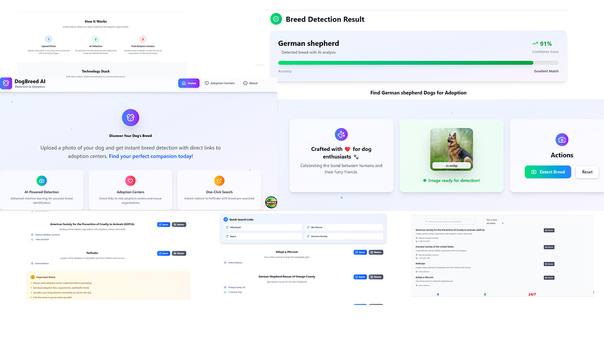

# 🐕 Dog Breed Detection & Adoption Platform

## Backend Part already included in this project and for frontend you can follow this

# For Frontend Part to extract click the link below
[Frontend](https://github.com/MDMEHEDIHASA/frontend)

## This is the frontend outlook result


## Description

- **data/raw/**: Store your original dataset (Images.zip)
- **src/steps/**: Individual pipeline steps
  - `data_divider.py`: Extracts and splits data into train/validation sets
  - `train_model.py`: Model training logic
  - `evaluate_model.py`: Model evaluation metrics
- **src/pipelines/**: Complete ML pipelines
- **src/utils/**: Helper functions and utilities
- **requirements.txt**: Python dependencies
- **zenml_config.yaml**: ZenML configuration


## To run this project in your code first extract this github file

```
# Create virtual environment
python -m venv zenml_env
conda activate zenml_env
# Then install requirements
pip install -r requirements.txt
#Then run to be locally connected with zenml
zenml login --blocing
#Then run the model file which run_training_pipeline.py
python run_training_pipeline.py
#If you want the see the result of evaluation result run
python run_evaluate_file.py
```

# This is the evaluation result

```
======================================================================
EVALUATION RESULTS
======================================================================
Classes in test data: 120 / 120
Accuracy:  0.7811 (78.11%)
Precision: 0.7940 (79.40%)
Recall:    0.7811 (78.11%)
F1 Score:  0.7803 (78.03%)
======================================================================

======================================================================
CLASSIFICATION REPORT
======================================================================
Note: Report includes only 120 out of 120 total classes present in test data

                                precision    recall  f1-score   support

                     Chihuahua       0.77      0.77      0.77        26
              Japanese spaniel       0.90      0.86      0.88        43
                   Maltese dog       0.75      0.88      0.81        48
                      Pekinese       0.76      0.83      0.79        30
                      Shih-Tzu       0.62      0.67      0.65        45
              Blenheim spaniel       1.00      0.82      0.90        39
                      papillon       0.88      0.95      0.91        38
                   toy terrier       0.66      0.84      0.74        25
           Rhodesian ridgeback       0.63      0.70      0.67        37
                  Afghan hound       0.81      0.96      0.88        56
                        basset       0.71      0.82      0.76        39
                        beagle       0.65      0.85      0.73        39
                    bloodhound       0.92      0.87      0.89        38
                      bluetick       0.79      0.90      0.84        30
       black-and-tan coonhound       1.00      0.87      0.93        31
                  Walker hound       0.60      0.48      0.53        25
              English foxhound       0.85      0.37      0.51        30
                       redbone       0.52      0.68      0.59        25
                        borzoi       0.95      0.59      0.73        32
               Irish wolfhound       0.61      0.68      0.64        41
             Italian greyhound       0.67      0.70      0.68        43
                       whippet       0.57      0.69      0.62        35
                  Ibizan hound       0.96      0.81      0.88        32
            Norwegian elkhound       0.85      0.88      0.86        32
                    otterhound       0.96      0.74      0.84        35
                        Saluki       0.82      0.88      0.85        42
            Scottish deerhound       0.87      0.64      0.74        53
                    Weimaraner       0.78      0.92      0.85        39
     Staffordshire bullterrier       0.42      0.56      0.48        25
American Staffordshire terrier       0.72      0.66      0.69        35
            Bedlington terrier       0.90      0.93      0.92        41
                Border terrier       0.95      0.90      0.93        42
            Kerry blue terrier       0.92      0.80      0.86        30
                 Irish terrier       0.88      0.82      0.85        28
               Norfolk terrier       0.84      0.57      0.68        37
               Norwich terrier       0.78      0.89      0.83        36
             Yorkshire terrier       0.57      0.46      0.51        35
       wire-haired fox terrier       0.84      0.53      0.65        30
              Lakeland terrier       0.72      0.64      0.67        44
              Sealyham terrier       0.87      0.87      0.87        45
                      Airedale       0.75      0.87      0.80        38
                         cairn       0.78      0.83      0.81        30
            Australian terrier       0.78      0.90      0.84        31
                Dandie Dinmont       0.97      0.88      0.92        32
                   Boston bull       0.82      0.80      0.81        35
           miniature schnauzer       0.75      0.69      0.72        35
               giant schnauzer       0.45      0.81      0.58        26
            standard schnauzer       0.59      0.57      0.58        28
                Scotch terrier       0.87      0.90      0.88        29
               Tibetan terrier       0.60      0.89      0.71        28
                 silky terrier       0.68      0.71      0.69        38
   soft-coated wheaten terrier       0.68      0.68      0.68        31
   West Highland white terrier       0.64      1.00      0.78        25
                         Lhasa       0.46      0.48      0.47        27
         flat-coated retriever       0.70      0.90      0.79        29
        curly-coated retriever       0.75      0.97      0.85        31
              golden retriever       0.74      0.86      0.79        29
            Labrador retriever       0.58      0.74      0.65        35
      Chesapeake Bay retriever       0.91      0.67      0.77        30
   German short-haired pointer       0.76      0.78      0.77        37
                        vizsla       0.74      0.83      0.79        42
                English setter       0.73      0.86      0.79        28
                  Irish setter       0.87      0.77      0.82        35
                 Gordon setter       1.00      0.84      0.91        31
              Brittany spaniel       0.85      0.72      0.78        32
                       clumber       0.97      0.90      0.93        31
              English springer       0.88      0.83      0.85        35
        Welsh springer spaniel       0.93      0.74      0.83        35
                cocker spaniel       0.87      0.74      0.80        35
                Sussex spaniel       0.90      0.80      0.85        35
           Irish water spaniel       0.85      0.92      0.88        36
                        kuvasz       0.84      0.88      0.86        24
                    schipperke       0.88      0.88      0.88        25
                   groenendael       0.97      0.93      0.95        30
                      malinois       0.80      0.88      0.84        32
                        briard       0.62      0.70      0.66        30
                        kelpie       0.74      0.72      0.73        32
                      komondor       0.83      0.91      0.87        32
          Old English sheepdog       0.91      0.86      0.89        36
             Shetland sheepdog       0.75      0.67      0.71        27
                        collie       0.55      0.39      0.46        28
                 Border collie       0.68      0.83      0.75        36
          Bouvier des Flandres       0.90      0.55      0.68        33
                    Rottweiler       0.80      0.94      0.86        34
               German shepherd       0.81      0.59      0.68        29
                      Doberman       0.86      0.86      0.86        29
            miniature pinscher       0.80      1.00      0.89        24
    Greater Swiss Mountain dog       0.61      0.83      0.70        24
          Bernese mountain dog       0.93      0.82      0.87        45
                   Appenzeller       0.68      0.68      0.68        28
                   EntleBucher       0.90      0.68      0.78        41
                         boxer       0.78      0.75      0.76        28
                  bull mastiff       0.77      0.86      0.81        28
               Tibetan mastiff       1.00      0.74      0.85        34
                French bulldog       0.63      0.83      0.72        29
                    Great Dane       0.87      0.65      0.74        31
                 Saint Bernard       0.97      0.92      0.94        37
                    Eskimo dog       0.37      0.46      0.41        28
                      malamute       0.69      0.58      0.63        31
                Siberian husky       0.66      0.49      0.56        39
                 affenpinscher       0.88      0.88      0.88        34
                       basenji       0.73      0.93      0.82        43
                           pug       0.74      0.95      0.83        42
                      Leonberg       0.91      0.97      0.94        40
                  Newfoundland       0.79      0.77      0.78        35
                Great Pyrenees       0.77      0.84      0.80        44
                       Samoyed       0.90      0.91      0.91        47
                    Pomeranian       0.93      0.89      0.91        44
                          chow       0.93      0.90      0.92        31
                      keeshond       1.00      0.97      0.99        34
             Brabancon griffon       1.00      0.77      0.87        39
                      Pembroke       0.90      0.85      0.88        41
                      Cardigan       0.71      0.60      0.65        25
                    toy poodle       0.62      0.60      0.61        42
              miniature poodle       0.60      0.37      0.45        41
               standard poodle       0.75      0.58      0.65        31
              Mexican hairless       0.94      0.89      0.92        38
                         dingo       0.79      0.77      0.78        30
                         dhole       0.97      0.88      0.92        34
           African hunting dog       0.95      0.90      0.93        42

                      accuracy                           0.78      4116
                     macro avg       0.79      0.78      0.77      4116
                  weighted avg       0.79      0.78      0.78      4116

======================================================================
INFO:root:Top-5 Accuracy: 0.9662 (96.62%)
INFO:root:Top-5 Accuracy: 0.9662

======================================================================
TOP 10 WORST PREDICTIONS
======================================================================
1. ✗ True: Ibizan hound                   Pred: whippet                        Conf: 99.82%
2. ✗ True: cocker spaniel                 Pred: Irish setter                   Conf: 99.20%
3. ✗ True: Bernese mountain dog           Pred: Greater Swiss Mountain dog     Conf: 99.09%
4. ✗ True: Tibetan terrier                Pred: Maltese dog                    Conf: 98.22%
5. ✗ True: Rhodesian ridgeback            Pred: vizsla                         Conf: 98.08%
6. ✗ True: Pembroke                       Pred: Cardigan                       Conf: 98.05%
7. ✗ True: Irish setter                   Pred: redbone                        Conf: 98.00%
8. ✗ True: Siberian husky                 Pred: malamute                       Conf: 97.95%
9. ✗ True: Tibetan mastiff                Pred: chow                           Conf: 97.50%
10. ✗ True: Boston bull                    Pred: French bulldog                 Conf: 97.45%
======================================================================
INFO:root:Confusion matrix saved to confusion_matrix.png
INFO:root:Confusion matrix saved
INFO:root:Results saved to evaluation_results.json
INFO:root:Evaluation completed successfully!
```


# For data collection 
[DataSet](http://vision.stanford.edu/aditya86/ImageNetDogs/)


##For dividing data into train and tes you can use this code 
```
#First go to the steps folder
python run data_divider.py
If you want to use the train and test split the data  you can use util file load_train_test_data function
```

## Check the result
```
#First extract the class name 
python run get_the_classname.py
#Then run the 
python check_result.py
```
## This is the result

🐕 Dog 1 Breed Predictions:
 - German shepherd (84.19%)
 - Norwegian elkhound (4.34%)
 - malinois (4.27%)


# 🐕 Dog Breed Detection & Adoption Platform

A professional full-stack application that combines AI-powered dog breed detection with adoption center integration. Built with React, Node.js, and modern web technologies.

## ✨ Features

- **🤖 AI-Powered Breed Detection** - Advanced machine learning models for accurate breed identification
- **🏠 Adoption Center Integration** - Direct links to real adoption centers and rescue organizations
- **🔗 One-Click Adoption Search** - Redirect users to Petfinder, Adopt-a-Pet, and other platforms with breed pre-searched
- **📱 Modern UI/UX** - Responsive React frontend with Tailwind CSS
- **🔒 Secure & Private** - Images processed securely and never stored permanently
- **⚡ Fast & Reliable** - Optimized for performance with proper error handling

## 🏗️ Architecture


```
┌─────────────────┐    ┌─────────────────┐    ┌─────────────────┐
│   React Frontend │    │   Node.js API   │    │  Python ML Model│
│   (Port 3000)    │◄──►│   (Port 5000)  │◄──►│   (Port 8000)   │
└─────────────────┘    └─────────────────┘    └─────────────────┘
```

## 🚀 Quick Start

### Prerequisites

- Node.js 20+ for frontend and backend 18+
- Python 3.8+ (for ML model)
- Docker (optional, for containerized deployment)

### Development Setup

1. **Clone the repository**
   ```bash
   git clone <repository-url>
   cd dog-breed-detection
   ```

2. **Backend Setup**
   ```bash
   cd backend
   npm install
   cp env.example .env
   # Edit .env with your configuration
   npm run dev
   ```

3. **Frontend Setup**
   ```bash
   cd frontend
   npm install
   npm start
   ```

4. **Access the application**
   - Frontend: http://localhost:3000
   - Backend API: http://localhost:5000
   - API Health: http://localhost:5000/api/health

### Docker Deployment

```bash
# Build and start all services
docker-compose up -d

# View logs
docker-compose logs -f

# Stop services
docker-compose down
```

## 📁 Project Structure

```
dog-breed-detection/
├── backend/                 # Node.js API server
│   ├── routes/             # API routes
│   ├── services/           # Business logic
│   ├── middleware/         # Express middleware
│   ├── uploads/            # Temporary file storage
│   └── server.js          # Main server file
├── frontend/               # React application
│   ├── src/
│   │   ├── components/    # React components
│   │   ├── pages/          # Page components
│   │   ├── services/       # API services
│   │   └── App.js          # Main app component
│   └── public/             # Static assets
├── docker-compose.yml      # Docker orchestration
└── README.md              # This file
```

## 🔧 API Endpoints

### Breed Detection
- `POST /api/breed/detect` - Upload image and detect breed
- `GET /api/breed/centers/:breed` - Get adoption centers for breed

### Adoption Centers
- `GET /api/adoption/centers` - Get all adoption centers
- `GET /api/adoption/centers/:breed` - Get centers for specific breed
- `GET /api/adoption/search-urls/:breed` - Get search URLs for breed
- `GET /api/adoption/redirect/:breed` - Redirect to adoption site

### Health Check
- `GET /api/health` - API health status

## 🎯 Usage Examples

### Upload Image and Detect Breed

```bash
curl -X POST http://localhost:5000/api/breed/detect \
  -F "image=@dog_photo.jpg"
```

**Response:**
```json
{
  "success": true,
  "breed": "German Shepherd",
  "confidence": 0.95,
  "adoption_centers": [...],
  "direct_search_urls": {
    "petfinder": "https://www.petfinder.com/search/dogs-for-adoption/?breed=German%20Shepherd",
    "adoptapet": "https://www.adoptapet.com/s/adoptable-dogs?breed=German%20Shepherd"
  },
  "redirect_info": {
    "petfinder_url": "https://www.petfinder.com/search/dogs-for-adoption/?breed=German%20Shepherd",
    "note": "Click any URL to search for this breed directly on the adoption website"
  }
}
```

### Get Adoption Centers for Breed

```bash
curl http://localhost:5000/api/adoption/centers/german%20shepherd
```

### Direct Redirect to Adoption Site

```bash
curl -L http://localhost:5000/api/adoption/redirect/german%20shepherd
# Redirects to Petfinder with German Shepherd pre-searched
```

## 🔒 Security Features

- **Rate Limiting** - 100 requests per 15 minutes per IP
- **File Validation** - Only image files allowed, 10MB max size
- **CORS Protection** - Configured for specific frontend URL
- **Helmet Security** - Security headers for XSS, CSRF protection
- **Input Validation** - Joi schema validation for all inputs
- **Error Handling** - Comprehensive error handling and logging

## 🚀 Deployment Options

### 1. Traditional Deployment

**Backend:**
```bash
cd backend
npm install --production
NODE_ENV=production npm start
```

**Frontend:**
```bash
cd frontend
npm run build
# Serve build/ directory with nginx or Apache
```

### 2. Docker Deployment

```bash
docker-compose up -d
```

### 3. Cloud Deployment

**Heroku:**
```bash
# Backend
cd backend
heroku create dog-breed-api
git push heroku main

# Frontend
cd frontend
heroku create dog-breed-frontend
git push heroku main
```

**AWS/GCP/Azure:**
- Use Docker containers
- Configure load balancers
- Set up SSL certificates
- Configure environment variables

## 🔧 Configuration

### Environment Variables

**Backend (.env):**
```env
PORT=5000
NODE_ENV=production
FRONTEND_URL=https://your-frontend-domain.com
MAX_FILE_SIZE=10485760
RATE_LIMIT_WINDOW_MS=900000
RATE_LIMIT_MAX_REQUESTS=100
```

**Frontend (.env):**
```env
REACT_APP_API_URL=https://your-api-domain.com/api
```

## 📊 Performance Optimization

- **Image Processing** - Sharp library for image optimization
- **Compression** - Gzip compression for API responses
- **Caching** - Static asset caching with proper headers
- **Rate Limiting** - Prevents API abuse
- **File Cleanup** - Automatic cleanup of temporary files

## 🧪 Testing

```bash
# Backend tests
cd backend
npm test

# Frontend tests
cd frontend
npm test
```

## 📈 Monitoring

- **Health Checks** - Built-in health check endpoints
- **Logging** - Morgan HTTP request logging
- **Error Tracking** - Comprehensive error handling
- **Performance** - Response time monitoring

## 🤝 Contributing

1. Fork the repository
2. Create a feature branch
3. Make your changes
4. Add tests if applicable
5. Submit a pull request

## 📄 License

This project is licensed under the MIT License - see the LICENSE file for details.

## 🆘 Support

For support and questions:
- Create an issue in the repository
- Check the documentation
- Review the API endpoints

## 🔮 Future Enhancements

- [ ] User authentication and profiles
- [ ] Favorite breeds and adoption centers
- [ ] Email notifications for new adoptable dogs
- [ ] Mobile app (React Native)
- [ ] Advanced ML model with more breeds
- [ ] Integration with more adoption platforms
- [ ] Real-time chat with adoption centers
- [ ] Adoption application tracking

---

**Built with ❤️ for dog lovers and their furry friends**